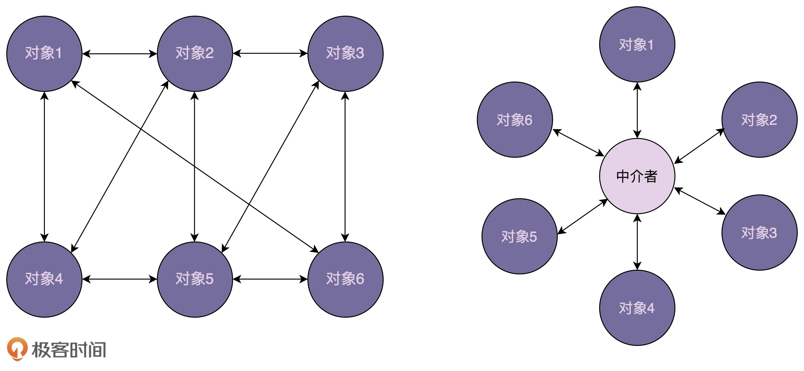

# 中介模式
>定义：将一个请求封装为一个对象，从而使你可用不同的请求对客户进行参数化；对请求排队或记录请求日志，以及支持可撤销的操作。

### 1. 中介模式的原理和实现
>通过引入中介这个中间层，将一组对象之间的交互关系（或者说依赖关系）从多对多（网状关系）转换为一对多（星状关系）。原来一个对象要跟 n 个对象交互，现在只需要跟一个中介对象交互，从而最小化对象之间的交互关系，降低了代码的复杂度，提高了代码的可读性和可维护性。


```java
public class CharRoom{
    public static void showMessage(User user,String message){
        System.out.println(new Date()+" ["+user.getName()+"] : "+message);
    }
}
```
```java
public class User{
    private String name;
    public User(String name){
        this.name = name;
    }
    public String getName(){
        return name;
    }
    public void setName(String name){
        this.name = name;
    }
    public void sendMessage(String message){
        CharRoom.showMessage(this,message);
    }
}
```


```java
public class TestMain{
    public static void main(String[] args) {
        User robert = new User("Robert");
        User john = new User("John");
        robert.sendMessage("Hi! John!");
        john.sendMessage("Hello! Robert!");
    }
}
```

### 2. 中介模式VS观察者模式
>前面讲观察者模式的时候，我们讲到，观察者模式有多种实现方式。虽然经典的实现方式没法彻底解耦观察者和被观察者，观察者需要注册到被观察者中，被观察者状态更新需要调用观察者的 update() 方法。但是，在跨进程的实现方式中，我们可以利用消息队列实现彻底解耦，观察者和被观察者都只需要跟消息队列交互，观察者完全不知道被观察者的存在，被观察者也完全不知道观察者的存在。  

>我们前面提到，中介模式也是为了解耦对象之间的交互，所有的参与者都只与中介进行交互。而观察者模式中的消息队列，就有点类似中介模式中的“中介”，观察者模式的中观察者和被观察者，就有点类似中介模式中的“参与者”。那问题来了：中介模式和观察者模式的区别在哪里呢？什么时候选择使用中介模式？什么时候选择使用观察者模式呢？  

>在观察者模式中，尽管一个参与者既可以是观察者，同时也可以是被观察者，但是，大部分情况下，交互关系往往都是单向的，一个参与者要么是观察者，要么是被观察者，不会兼具两种身份。也就是说，在观察者模式的应用场景中，参与者之间的交互关系比较有条理。  

>而中介模式正好相反。只有当参与者之间的交互关系错综复杂，维护成本很高的时候，我们才考虑使用中介模式。毕竟，中介模式的应用会带来一定的副作用，前面也讲到，它有可能会产生大而复杂的上帝类。除此之外，如果一个参与者状态的改变，其他参与者执行的操作有一定先后顺序的要求，这个时候，中介模式就可以利用中介类，通过先后调用不同参与者的方法，来实现顺序的控制，而观察者模式是无法实现这样的顺序要求的。  
