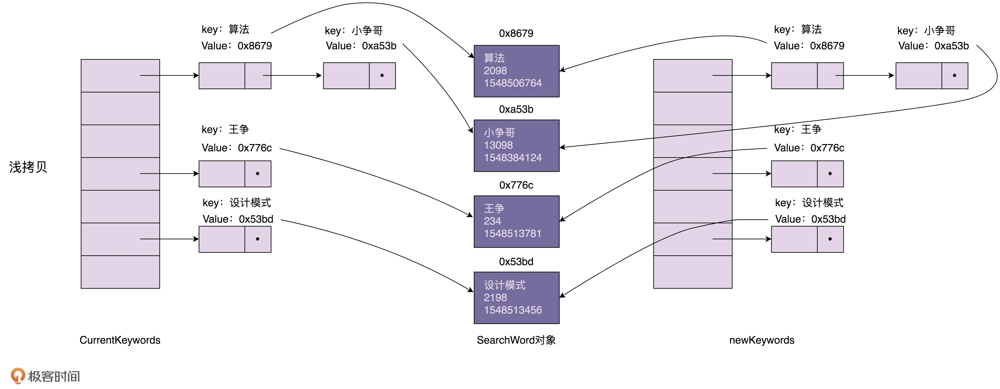
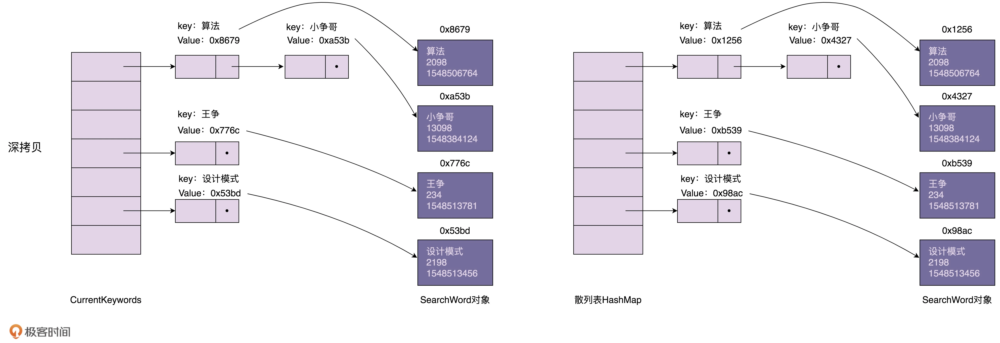

# 原型模式

> 定义：用原型实例指定创建对象的种类，并且通过拷贝这些原型创建新的对象。

如果对象的创建成本比较大，而同一个类的不同对象之间差别不大（大部分字段都相同），在这种情况下，我们可以利用对已有对象（原型）进行复制（或者叫拷贝）的方式来创建新对象，以达到节省创建时间的目的。这种基于原型来创建对象的方式就叫作
**原型设计模式**（Prototype Design Pattern），简称**原型模式**。

### 1、原型模式实现的方式:深拷贝和浅拷贝

#### 1.1、浅拷贝

浅拷贝是指在拷贝对象时，对于基本数据类型的变量（如int、double、char等）会重新复制一份，而对于引用类型的变量（如对象、数组、接口等）只是拷贝一份引用，因此如果其中一个对象改变了这个引用的值，那么另一个对象也会相应地改变这个引用的值。


#### 1.2、深拷贝

深拷贝是指在拷贝对象时，不仅会重新复制一份基本数据类型的变量，而且会重新复制一份引用类型的变量。


```java
/**
 * <p>
 * 我们可以先采用浅拷贝的方式创建 newKeywords。
 * 对于需要更新的 SearchWord 对象，
 * 我们再使用深度拷贝的方式创建一份新的对象，替换 newKeywords 中的老对象
 * </p>
 */

public class Demo {
    private HashMap<String, SearchWord> currentKeywords = new HashMap<>();
    private long lastUpdateTime = -1;

    public void refresh() {
        //浅拷贝
        HashMap<String, SearchWord> newKeywords = (HashMap<String, SearchWord>) currentKeywords.clone();
        //从数据库中取出更新时间>lastUpdateTime的数据，放入到newKeywords中
        List<SearchWord> toBeUpdatedSearchWords = getSearchWords(lastUpdateTime);
        long maxNewUpdatedTime = lastUpdateTime;
        for (SearchWord searchWord : toBeUpdatedSearchWords) {
            if (searchWord.getLastUpdateTime() > maxNewUpdatedTime) {
                maxNewUpdatedTime = searchWord.getLastUpdateTime();
            }
            if (newKeywords.containsKey(searchWord.getKeyword())) {
                newKeywords.remove(searchWord.getKeyword(), searchWord);
            }
            newKeywords.put(searchWord.getKeyword(), searchWord);
        }
        lastUpdateTime = maxNewUpdatedTime;
        currentKeywords = newKeywords;
    }
}
```