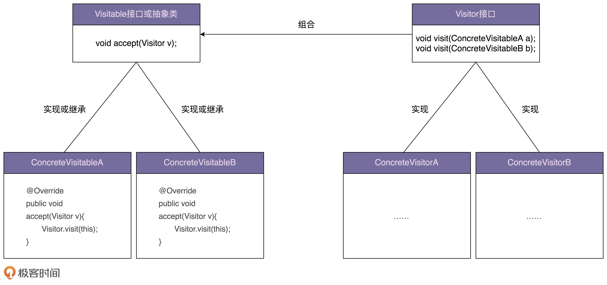

# 访问者模式
>定义：封装一些作用于某种数据结构中的各元素的操作，它可以在不改变这个数据结构的前提下定义作用于这些元素的新的操作。


### 1. 适用场景
一般来说，访问者模式针对的是一组类型不同的对象（PdfFile、PPTFile、WordFile）。不过，尽管这组对象的类型是不同的，但是，它们继承相同的父类（ResourceFile）或者实现相同的接口。在不同的应用场景下，我们需要对这组对象进行一系列不相关的业务操作（抽取文本、压缩等），但为了避免不断添加功能导致类（PdfFile、PPTFile、WordFile）不断膨胀，职责越来越不单一，以及避免频繁地添加功能导致的频繁代码修改，我们使用访问者模式，将对象与操作解耦，将这些业务操作抽离出来，定义在独立细分的访问者类（Extractor、Compressor）中。



```java
public abstract class ResourceFile {
    protected String filePath;
    public ResourceFile(String filePath) {
        this.filePath = filePath;
    }
    abstract public void accept(Visitor visitor);
}
```

```java
public class PdfFile extends ResourceFile {
    public PdfFile(String filePath) {
        super(filePath);
    }
    @Override
    public void accept(Visitor visitor) {
        visitor.visit(this);
    }
    //...
}
```

```java
public class PPtFile extends ResourceFile {
    public PPtFile(String filePath) {
        super(filePath);
    }
    @Override
    public void accept(Visitor visitor) {
        visitor.visit(this);
    }
    //...
}
```

```java
public class WordFile extends ResourceFile {
    public WordFile(String filePath) {
        super(filePath);
    }
    @Override
    public void accept(Visitor visitor) {
        visitor.visit(this);
    }
    //...
}
```

```java
public interface Visitor {
    void visit(PdfFile pdfFile);
    void visit(PPTFile pdfFile);
    void visit(WordFile pdfFile);
}
```

```java
public class Extractor implements Visitor {
    @Override
    public void visit(PdfFile pdfFile) {
        //...
        System.out.println("Extract PDF.");
    }
    @Override
    public void visit(PPTFile pdfFile) {
        //...
        System.out.println("Extract PPT.");
    }
    @Override
    public void visit(WordFile pdfFile) {
        //...
        System.out.println("Extract WORD.");
    }
}
```

```java
public class Compressor implements Visitor {
    @Override
    public void visit(PdfFile pdfFile) {
        //...
        System.out.println("Compress PDF.");
    }
    @Override
    public void visit(PPTFile pdfFile) {
        //...
        System.out.println("Compress PPT.");
    }
    @Override
    public void visit(WordFile pdfFile) {
        //...
        System.out.println("Compress WORD.");
    }
}
```

```java
public class ToolApplication {
    public static void main(String[] args) {
        Extractor extractor = new Extractor();
        List<ResourceFile> resourceFiles = listAllResourceFiles();
        for (ResourceFile resourceFile : resourceFiles) {
            resourceFile.accept(extractor);
        }
        Compressor compressor = new Compressor();
        for (ResourceFile resourceFile : resourceFiles) {
            resourceFile.accept(compressor);
        }
    }
    private static List<ResourceFile> listAllResourceFiles() {
        List<ResourceFile> resourceFiles = new ArrayList<>();
        resourceFiles.add(new PdfFile("a.pdf"));
        resourceFiles.add(new WordFile("b.word"));
        resourceFiles.add(new PPTFile("c.ppt"));
        return resourceFiles;
    }
}
```